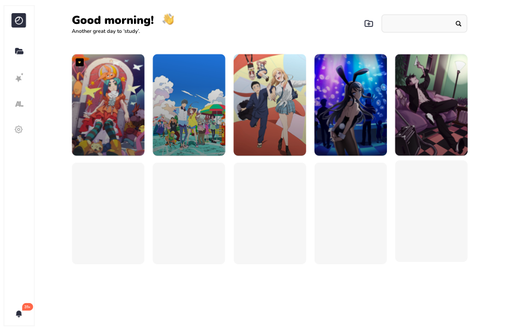
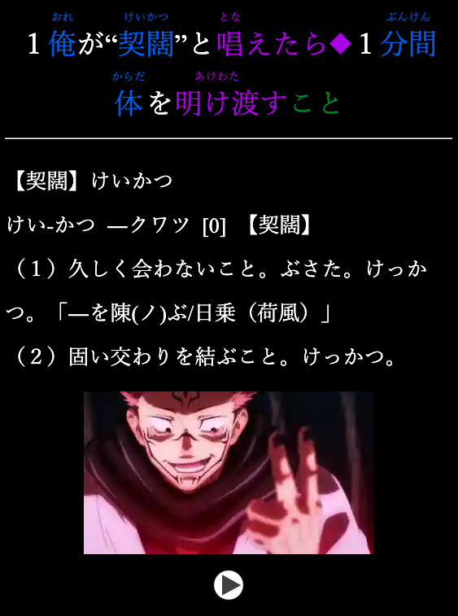

    
    <h1 style="margin: 0; padding: 40px;">Display</h1>

####  Created to make _**Your Life**_ easier when learning Japanese from Anime!

Display is a program designed to cut down the process of downloading a movie player, installing plugins
and setting every thing up right with Anki to watch downloaded Anime.

## Features

Display will have many of the same kind of features many Netflix or Youtube language learning plugins have,
but then focused for downloaded content like anime.

With this program you will be able to smoothly connect to [Anki](https://apps.ankiweb.net/), watch and make cards in a fly.

    

 

    
Example of the kind of card:

    

